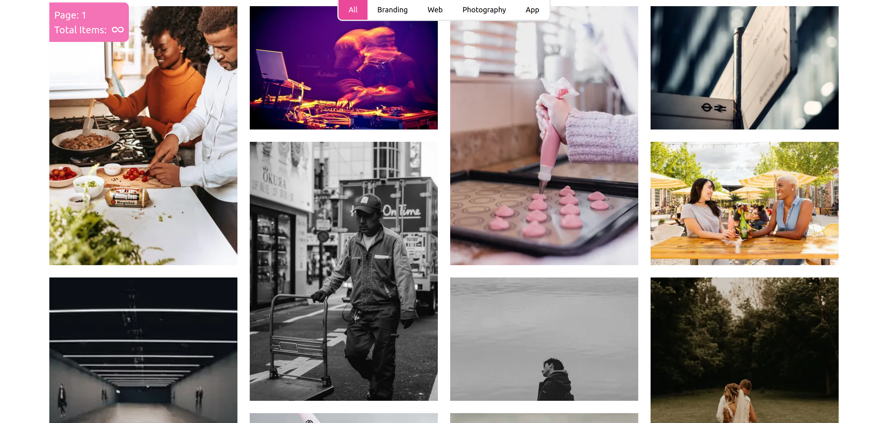
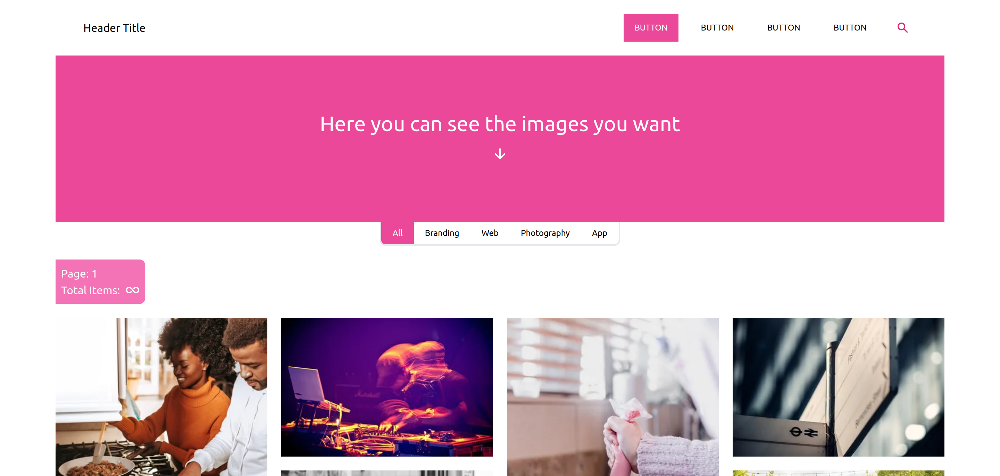
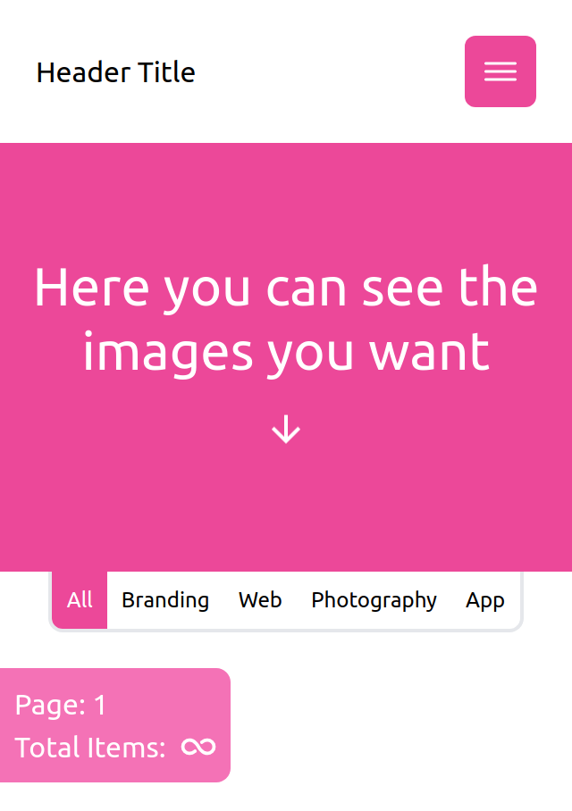

## Demo
https://image-viewer-willydavidlozada.vercel.app/





# Getting Started

First, run the development server:

```bash
npm run dev
```

## Technologies
- NextJS
- TypeScript
- Tailwindcss
### Api
- Unsplash
# Env
Create in the root of the project .env.local and add this variable

```
NEXT_PUBLIC_CLIENT_ID_UNPLASH= ***CLIENT_ID***
```

# Improvements
- Virtualization

Open [http://localhost:3000](http://localhost:3000) with your browser to see the result.